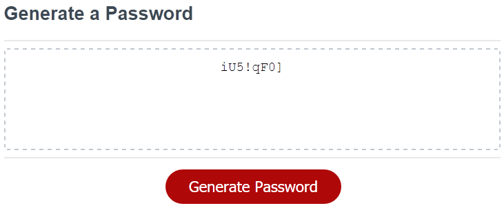
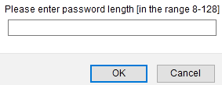
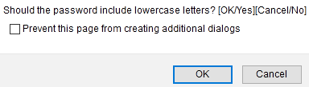

# Password_Generator
This repo contains a website that will help the user to generate a strong password. The generated password will be between 8 and 128 characters and include one or more of the following character types: lowercase letters, uppercase letters, numbers, and special characters.

## Usage
* Click on the red 'Generate Password' button to being the process.  
  > 
* You'll then be prompted to enter the password length.  
  > 

  Enter a number from 8 to 128. Pressing 'Cancel' will abort/stop the password generating process.
* You'll then be prompted to specify the character types you'd like to include in the password.  
  The following prompt asks whether you'd like to include 'lowercase' characters:  
  > 

  You'll receive similar prompts to confirm the inclusion of uppercase, numeric, and special characters.
* After you've specified the various criteria, the generated password will be displayed within the textbox area.

[Try it here!](https://cek333.github.io/Password_Generator/)
